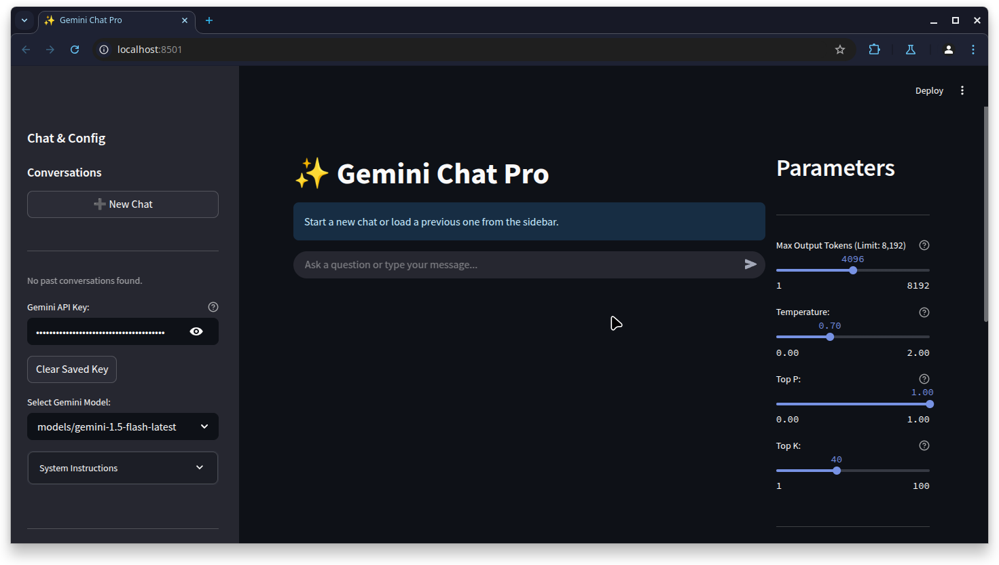

# AI Studio UI

[](https://github.com/colonelpanik/ai_studio_ui) [](https://www.python.org/downloads/)
[](https://streamlit.io/)
[](https://opensource.org/licenses/MIT)
[](https://github.com/colonelpanik/ai_studio_ui/actions/workflows/ci.yaml)

A Streamlit-based chat interface for interacting with Google Gemini models, designed for text inferencing with local file context integration.

---

## Table of Contents

-   [About The Project](#about-the-project)
-   [Key Features](#key-features)
-   [Built With](#built-with)
-   [Getting Started](#getting-started)
    -   [Prerequisites](#prerequisites)
    -   [Installation](#installation)
-   [Usage](#usage)
-   [Running with Docker](#running-with-docker)
-   [Configuration](#configuration)
-   [Database Information](#database-information)
-   [Contributing](#contributing)
-   [License](#license)
-   [Acknowledgements](#acknowledgements)

---

## About The Project

AI Studio UI provides a web interface ("Gemini Chat Pro") built with Streamlit for interacting with Google's Gemini large language models via their API. It focuses on text-based chat interactions, particularly those requiring context from local files.

Key aspects compared to general web interfaces:

* **Local Context Handling:** Allows selecting local files or folders. The application scans and includes content from specified file types into the prompt context. It supports recursive directory scanning and reflects local file changes upon manual refresh.
* **Persistent Local Storage:** Conversation history, messages, settings (parameters, instructions, context paths), and the API key are stored locally in an SQLite database (`gemini_chat_history.db`), not requiring cloud storage.
* **Configurability:** Provides UI controls for generation parameters (Temperature, Top-K, Top-P, etc.), model selection, system instructions, and context management.
* **Open Source:** Developed as a Streamlit application, allowing code inspection and modification.

This tool is suitable for users needing a local interface for Gemini that integrates local file context and maintains persistent chat histories.

---

## Key Features

* **Google Gemini Integration:** Connects to the Google Generative AI API using various Gemini models (e.g., `gemini-1.5-flash-latest`).
* **Local Context Injection:** Supports adding local files or folders for inclusion in the prompt context. Reads text-based content (code, markdown, etc.).
* **Configurable File Handling:** Define allowed/excluded file extensions, ignored directories, and maximum file size limits via constants in `gemini_logic.py`.
* **Persistent History:** Stores conversations, messages, saved system instructions, and the API key locally in an SQLite database.
* **Pinned Settings:** Saves generation parameters, system instruction, and context paths per conversation; restores them when the conversation is loaded.
* **Parameter Control:** Adjust Temperature, Top-P, Top-K, Max Output Tokens, Stop Sequences, and request JSON output via UI controls. Model-specific token limits are applied.
* **Instruction Management:** Save and load named system instructions.
* **Dynamic Model Selection:** Fetches and lists available Gemini models based on the provided API key.
* **Token Counting:** Calculates and displays the token count for system instructions and injected file context.
* **API Key Handling:** Stores the API key locally in the SQLite database. Provides an option to clear the saved key.
* **Streamlit Interface:** Provides a web UI using Streamlit.
* **Startup Script:** Includes `run.sh` for version checking, updates via git, dependency installation, and application launch.
* **Logging:** Supports configurable logging to file and console.

---

## Built With

* [Python](https://www.python.org/) (3.9+ Recommended)
* [Streamlit](https://streamlit.io/)
* [Google Generative AI SDK for Python](https://github.com/google/generative-ai-python)
* [SQLite](https://www.sqlite.org/index.html) (via Python's `sqlite3` module)

---

## Getting Started

Follow these steps to run AI Studio UI locally.

### Prerequisites

* **Python:** Version 3.9 or higher.
* **Pip:** Python package installer.
* **Git:** Required for cloning and the update functionality in `run.sh`.
* **Google Gemini API Key:** Obtainable from Google AI Studio. [Get an API key](https://aistudio.google.com/app/apikey).
* **(For run.sh):** Unix-like environment (Linux, macOS, WSL) with `bash`, `curl`, `git`.

### Installation

**Option 1: Using `run.sh` (Recommended for Linux/macOS/WSL)**

1.  **Clone the repository:**
    ```bash
    git clone https://github.com/colonelpanik/ai_studio_ui.git # Use your fork URL if applicable
    cd ai_studio_ui
    ```
2.  **Create `VERSION` file:** Create a file named `VERSION` containing the current version string (e.g., `2.2.0`). Commit this to your repository.
3.  **Set Remote URL in `run.sh`:** Edit `run.sh` and replace `YOUR_GITHUB_REPO_RAW_URL/VERSION` with the raw URL to your `VERSION` file on GitHub.
4.  **Make `run.sh` executable:**
    ```bash
    chmod +x run.sh
    ```
5.  **Run the script:**
    ```bash
    ./run.sh
    ```
    The script handles version checking, git pull, virtual environment setup, dependency installation, and application launch.

**Option 2: Manual Installation**

1.  **Clone the repository:**
    ```bash
    git clone https://github.com/colonelpanik/ai_studio_ui.git # Use your fork URL if applicable
    cd ai_studio_ui
    ```
2.  **Create `VERSION` file:** (Optional, for use with `run.sh` later) Create `VERSION` file with the version string.
3.  **Create a virtual environment (Recommended):**
    ```bash
    python3 -m venv .venv # Or use python
    # Activate (Linux/macOS/WSL):
    source .venv/bin/activate
    # Activate (Windows):
    # .venv\Scripts\activate
    ```
4.  **Install dependencies:**
    Ensure `requirements.txt` exists.
    ```bash
    pip install -r requirements.txt
    ```

---

## Usage

1.  **Run the Streamlit app:**
    * If using `run.sh`, it starts automatically.
    * If installed manually, activate the virtual environment and run:
        ```bash
        streamlit run gemini_local_chat.py
        ```
2.  **Open browser:** Access the local URL provided by Streamlit (e.g., `http://localhost:8501`).
3.  **Enter API Key:** Provide your Google Gemini API Key in the sidebar. It will be saved locally in `gemini_chat_history.db`.
4.  **Select Model:** Choose a Gemini model from the dropdown (populates after key entry).
5.  **Manage Context (Optional):** Use the "Manage Context" section to add local file/folder paths.
6.  **Set System Instruction (Optional):** Use the "System Instructions" section to provide model guidance or load/save instructions.
7.  **Adjust Parameters (Optional):** Use the controls in the right column to set generation parameters.
8.  **Chat:** Enter prompts in the input field.

When starting a new chat, the first message sets the title, and current settings (parameters, instruction, context paths) are saved with the conversation.

---

## Running with Docker

Build and run the application using the provided `Dockerfile`.

**Option 1: Use Pre-built Image**

1.  Pull the image:
    ```bash
    docker pull ghcr.io/colonelpanik/ai_studio_ui:main
    ```
    (See repository Packages tab for alternatives: https://github.com/colonelpanik/ai_studio_ui/pkgs/container/ai_studio_ui)
2.  Proceed to the `docker run` command below.

**Option 2: Build Locally**

1.  **Ensure `Dockerfile` exists:** Use the `Dockerfile` included in the project root.
2.  **Build the Docker image:**
    From the project root directory:
    ```bash
    docker build -t gemini-chat-ui .
    ```
    (Replace `gemini-chat-ui` with your desired image name).
3.  **Run the Docker container:**
    ```bash
    docker run -p 8501:8501 --rm --name gemini-chat-app \
      -v "$(pwd)/gemini_chat_history.db:/app/gemini_chat_history.db" \
      -v "$(pwd)/logs:/app/logs" \
      gemini-chat-ui # Or ghcr.io/colonelpanik/ai_studio_ui:main if using pre-built
    ```
    **Explanation:**
    * `-p 8501:8501`: Maps host port 8501 to container port 8501.
    * `--rm`: Removes the container on exit.
    * `--name gemini-chat-app`: Names the container.
    * `-v "$(pwd)/gemini_chat_history.db:/app/gemini_chat_history.db"`: Mounts the local database file into the container for persistence. Creates the file locally if it doesn't exist.
    * `-v "$(pwd)/logs:/app/logs"`: Mounts the local `logs` directory into the container.
    * `gemini-chat-ui`: The image name (built locally or pulled).

4.  **Access the app:** Open `http://localhost:8501` in your browser.

**Note on Context Paths in Docker:** Adding host machine paths directly via the UI is not possible when running in Docker. Mount required host directories into the container using additional `-v` flags (e.g., `-v "/path/on/host:/data/context"`) and add the container-internal path (e.g., `/data/context`) via the UI.

---

## Configuration

Configuration is primarily handled through the UI:

* **API Key:** Set in the sidebar (stored in `gemini_chat_history.db`).
* **Model:** Select from the sidebar dropdown.
* **Context Paths:** Add/remove paths in the "Manage Context" section. File filtering rules are defined in `gemini_logic.py`. Docker usage requires volume mapping.
* **System Instructions:** Enter directly or use save/load controls. Stored in the database.
* **Generation Parameters:** Adjust controls (Temperature, Top-P, Top-K, etc.) in the right-hand column. Settings saved per conversation.

---

## Database Information

* **File:** `gemini_chat_history.db` (created in the project root or mounted volume).
* **Type:** SQLite.
* **Tables:**
    * `conversations`: Conversation metadata, ID, title, timestamps, saved settings (JSON).
    * `chat_messages`: Individual messages linked to conversations.
    * `instructions`: Saved named system instructions.
    * `settings`: Application settings (currently API key).
* **Schema Changes:** Basic column addition is handled. Significant schema updates between versions might require manual database adjustments or deletion (losing history).

---

## Contributing

Contributions are welcome.

1.  Fork the Project
2.  Create your Feature Branch (`git checkout -b feature/NewFeature`)
3.  Commit your Changes (`git commit -m 'Add NewFeature'`)
4.  Push to the Branch (`git push origin feature/NewFeature`)
5.  Open a Pull Request

Refer to the [Issue Tracker](https://github.com/colonelpanik/ai_studio_ui/issues) for existing items.

---

## License

Distributed under the MIT License. Ensure a `LICENSE.txt` file is included in the repository.

---

## Acknowledgements

* Google Gemini Team
* Streamlit Team
* Google Generative AI Python SDK Developers

---
